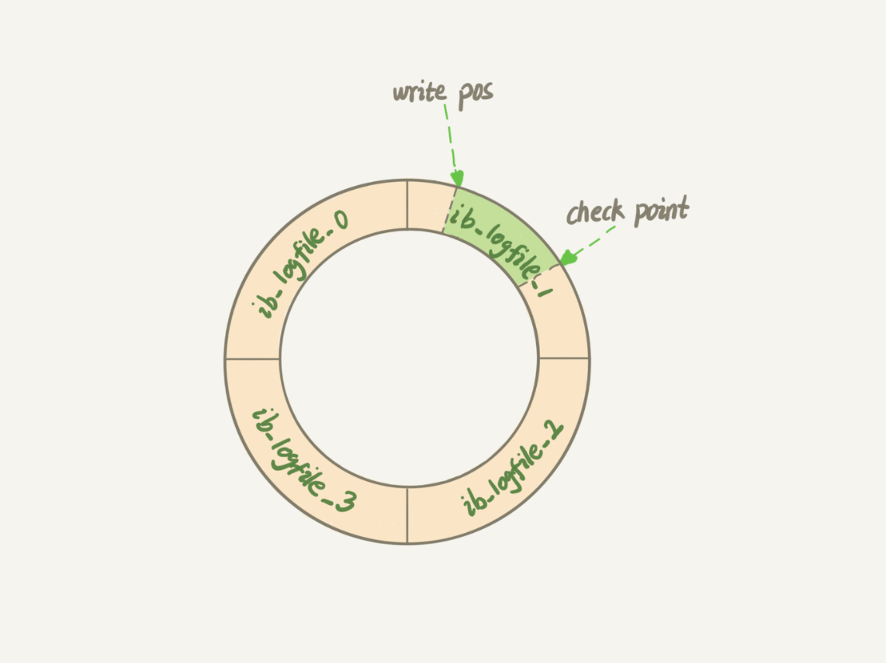
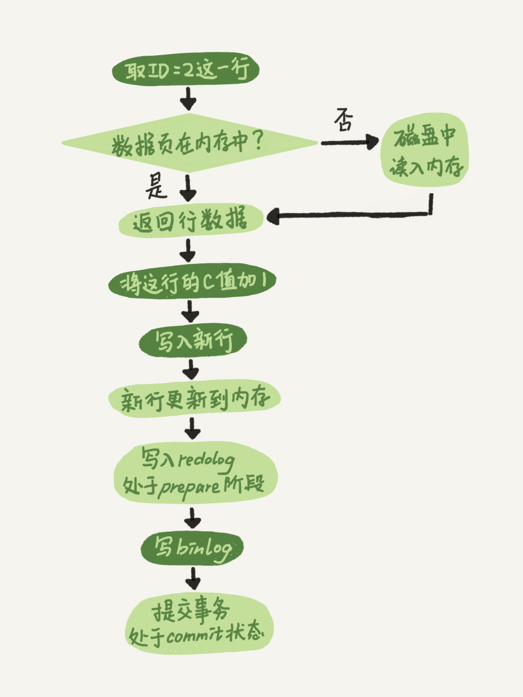

**事务、索引、锁等是数据库使用中的高频知识点**
## 一、SQL查询语句执行过程


Mysql主要分成Server层和存储引擎层。

Server 层包括连接器、查询缓存、分析器、优化器、执行器等，涵盖 MySQL 的大多数核心服务功能，以及所有的内置函数（如日期、时间、数学和加密函数等），所有跨存储引擎的功能都在这一层实现，比如存储过程、触发器、视图等。

而存储引擎层负责数据的存储和提取。其架构模式是插件式的，支持 InnoDB、MyISAM、Memory 等多个存储引擎。现在最常用的存储引擎是 InnoDB，它从 MySQL 5.5.5 版本开始成为了默认存储引擎。

从图中不难看出，不同的存储引擎共用一个Server 层

### 1.1 连接器
 连接过程非常复杂，所以建议在使用的时候减少连接的动作，也就是尽量使用长连接。但是有些资源需要在连接断口之后才能回收（临时使用的内存是管理在连接对象中）
**建议：**
1. 定期断开长连接
2. Mysql5.7或更新版本，执行一次比较大的操作后，手动初始化连接资源 mysql_reset_connection。这个过程不需要重新连接和重现权限校验。

### 1.2 查询缓存
**不建议使用**， 失效很频繁，只要表更新所有缓存都被清空。对于更新压力大的数据库，命中率很低，可以按需使用(配置表等)，可以将参数 query_cache_type 设置成 DEMAND，这样对于默认的 SQL 语句都不使用查询缓存。而对于你确定要使用查询缓存的语句，可以用 SQL_CACHE 显式指定，像下面这个语句一样：

```sql
select SQL_CACHE * from T where ID=10;
```
**【注意】**：mysql 8.0 删除查询缓存功能

### 1.3 分析器
 mysql 分析器类似于，主要是做词法和语法分析， 词法分析是分析这是个什么语句，把表名，列等识别出来，而语法分析是看他是否满足mysql的语法。**解决做什么的问题**
### 1.4 优化器
优化器做的功能包括  用哪个索引，关联语句决定表的连接顺序，也就是执行计划，优化器选索引啥的可能选错。**解决怎么做的问题**
### 1.5 执行器
开始执行的时候判断是否有权限，没权限直接就返回错误码，有权限了就开始搞， 上面的查询缓存是在返回之前判断权限。
打开表的时候执行器会根据表的引擎定义去选择相应的引擎接口。
比如我们这个例子中的表 T 中，ID 字段没有索引，那么执行器的执行流程是这样的：
1. 调用 InnoDB 引擎接口取这个表的第一行，判断 ID 值是不是 10，如果不是则跳过，如果是则将这行存在结果集中；
2. 调用引擎接口取“下一行”，重复相同的判断逻辑，直到取到这个表的最后一行。
3. 执行器将上述遍历过程中所有满足条件的行组成的记录集作为结果集返回给客户端。

至此，这个语句就执行完成了。

对于有索引的表，执行的逻辑也差不多。第一次调用的是“取满足条件的第一行”这个接口，之后循环取“满足条件的下一行”这个接口，这些接口都是引擎中已经定义好的。

慢查询日志里面看到的row_examined的字段是表示扫描过的行，这个字段是是在每次调用引擎获取数据行的时候累加的，在有些场景下，执行器调用一次，在引擎内部则扫描了多行，因此引擎扫描行数跟 rows_examined 并不是完全相同的。

## 二、SQL 更新语句执行过程
```sql
mysql> create table T(ID int primary key, c int);
mysql> update T set c=c+1 where ID=2;
```
1. 连接器和前面一样
2. 更新语句会清空查询缓存
3. 分析器会通过词法和语法解析知道这是一条更新语句
4. 优化器决定使用ID这个索引
5. 执行器具体去执行，找到这一行并更新。
**与查询流程不一样的是，更新流程涉及两个重要的日志模板：redo log(重做日志)和binlog(归档日志)**
redo log和 binlog的设计思路可以用到我们自己的程序里面。

### 2.1 重要日志模块 redo log
redo log用《孔乙己》酒店掌柜的粉板和记账本为例子更好理解。
在 MySQL 里也有这个问题，如果每一次的更新操作都需要写进磁盘，然后磁盘也要找到对应的那条记录，然后再更新，整个过程 IO 成本、查找成本都很高。为了解决这个问题，MySQL 的设计者就用了类似酒店掌柜粉板的思路来提升更新效率。

而粉板和账本配合的整个过程，其实就是 MySQL 里经常说到的 WAL 技术，WAL 的全称是 Write-Ahead Logging，它的关键点就是先写日志，再写磁盘，也就是先写粉板，等不忙的时候再写账本。

具体来说，当有一条记录需要更新的时候，InnoDB 引擎就会先把记录写到 redo log（粉板）里面，并更新内存，这个时候更新就算完成了。同时，InnoDB 引擎会在适当的时候，将这个操作记录更新到磁盘里面，而这个更新往往是在系统比较空闲的时候做，这就像打烊以后掌柜做的事。


write pos 和 checkpoint 之间的是“粉板”上还空着的部分，可以用来记录新的操作。如果 write pos 追上 checkpoint，表示“粉板”满了，这时候不能再执行新的更新，得停下来先擦掉一些记录，把 checkpoint 推进一下。

有了 redo log，InnoDB 就可以保证即使数据库发生异常重启，之前提交的记录都不会丢失，这个能力称为crash-safe。只要赊账记录记在了粉板上或写在了账本上，之后即使掌柜忘记了，比如突然停业几天，恢复生意后依然可以通过账本和粉板上的数据明确赊账账目。

### 2.2 重要日志模块：binlog

**redo log** 是InnoDB引擎特有的日志，而Server层也有自己的日志，称为binlog(归档日志)。
为什么会有两份日志呢。因为最开始mysql的引擎是MyISAM,但是他们有crash-safe能力，binlog只能用来归档。所以InnoDB使用了redo log来实现crash-safe能力。

这两个日志的不同点：
1. redo log 是 InnoDB 引擎特有的；binlog 是 MySQL 的 Server 层实现的，所有引擎都可以使用。
2. redo log 是物理日志，记录的是“在某个数据页上做了什么修改”；binlog 是逻辑日志，记录的是这个语句的原始逻辑，比如“给 ID=2 这一行的 c 字段加 1 ”。
3. redo log 是循环写的，空间固定会用完；binlog 是可以追加写入的。“追加写”是指 binlog 文件写到一定大小后会切换到下一个，并不会覆盖以前的日志。

#### 2.2.1 执行器和 InnoDB 引擎在执行 update 语句时的内部流程
1. 执行器先找引擎取 ID=2 这一行。ID 是主键，引擎直接用树搜索找到这一行。如果 ID=2 这一行所在的数据页本来就在内存中，就直接返回给执行器；否则，需要先从磁盘读入内存，然后再返回。
2. 执行器拿到引擎给的行数据，把这个值加上 1，比如原来是 N，现在就是 N+1，得到新的一行数据，再调用引擎接口写入这行新数据。
3. 引擎将这行新数据更新到内存中，同时将这个更新操作记录到 redo log 里面，此时 redo log 处于 prepare 状态。然后告知执行器执行完成了，随时可以提交事务。
4. 执行器生成这个操作的 binlog，并把 binlog 写入磁盘。
5. 执行器调用引擎的提交事务接口，引擎把刚刚写入的 redo log 改成提交（commit）状态，更新完成。




将 redo log 的写入拆成了两个步骤：prepare 和 commit，这就是"两阶段提交"。
为什么必须有“两阶段提交”呢？这是为了让两份日志之间的逻辑一致。

1. 先写 redo log 后写 binlog，假如中途crash了，会导致binlog少一条更新记录，需要用这个 binlog 来恢复临时库的话，由于这个语句的 binlog 丢失，这个临时库就会少了这一次更新，与原库不一致
2. 先写 binlog 后写 redo log，如果在 binlog 写完之后 crash，由于 redo log 还没写，崩溃恢复以后这个事务无效，但是用binlog恢复出来的临时库有这个更新操作，与原库不一致。

**不只是误操作后需要用这个过程来恢复数据。当你需要扩容的时候，也就是需要再多搭建一些备库来增加系统的读能力的时候，现在常见的做法也是用全量备份加上应用 binlog 来实现的，这个“不一致”就会导致你的线上出现主从数据库不一致的情况。**


## 三、怎样让数据库恢复到半个月内任意一秒的状态？
binlog 会记录所有的逻辑操作，并且是采用“追加写”的形式。如果你的 DBA 承诺说半个月内可以恢复，那么备份系统中一定会保存最近半个月的所有 binlog，同时系统会定期做整库备份。这里的“定期”取决于系统的重要性，可以是一天一备，也可以是一周一备。